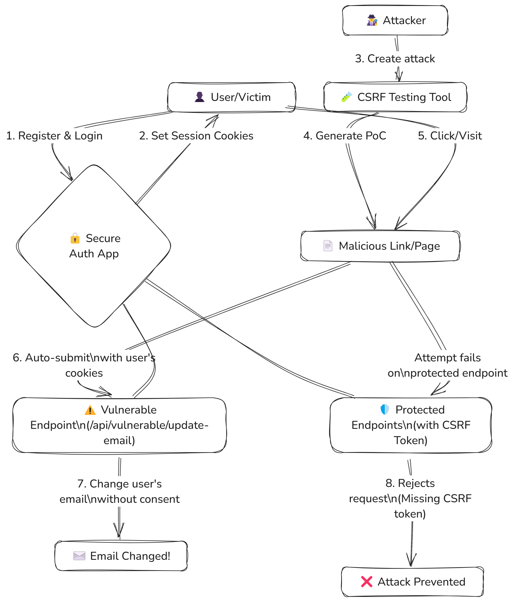

# Secure Authentication App with CSRF Demo

This project demonstrates secure authentication practices and CSRF (Cross-Site Request Forgery) vulnerabilities through a practical web application.



## Project Overview

This educational project consists of two main components:

1. **Secure Authentication App**: A Node.js Express application implementing best practices in web authentication and security.
2. **CSRF Testing Tools**: Utilities to demonstrate how CSRF attacks work and how to protect against them.

## Features

### Authentication System
- User registration with strong password requirements
- Secure login with session management
- Protection against brute force attacks
- Account locking after failed attempts
- CSRF protection on sensitive operations

### Security Implementations
- Password hashing with bcrypt
- Rate limiting for login attempts
- HTTPS-only cookies
- SameSite cookie restrictions
- CSRF token validation
- Input validation and sanitization
- Content Security Policy (CSP)
- Protection against common web vulnerabilities

### CSRF Demonstration
- Deliberate vulnerable endpoint to demonstrate CSRF attacks
- Interactive CSRF test tool for educational purposes
- Step-by-step guide to understand and test CSRF vulnerabilities

## Setup Instructions

### Prerequisites
- Node.js (v12 or higher)
- npm or yarn

### Installation

1. Clone the repository
2. Install dependencies:
   ```
   cd secure-auth-app
   npm install
   ```
3. Start the application:
   ```
   npm run dev
   ```
4. Access the application at `http://localhost:3000`

## Educational Use

This project contains deliberately vulnerable components marked clearly for educational purposes. The CSRF demonstration tools help understand:

1. How CSRF attacks work
2. Why CSRF protection is necessary
3. How to implement proper CSRF protections

## Directory Structure

- `/secure-auth-app/` - Main application
  - `/public/` - Static files and frontend
  - `/routes/` - API routes
  - `/middleware/` - Express middleware
  - `app.js` - Main application file
- `csrf-test.html` & `csrf-test.js` - CSRF testing tool
- `csrf-demo-instructions.html` - Tutorial for CSRF demonstration

## Testing the CSRF Vulnerability

1. Register and login to the secure app
2. Open the CSRF test tool in another tab
3. Configure it to target the vulnerable endpoint
4. Generate and execute the CSRF attack
5. Observe how the application state changes without user consent

## Security Notice

This application contains deliberately vulnerable code for educational purposes. Do not use the vulnerable patterns demonstrated in this project in production environments.
